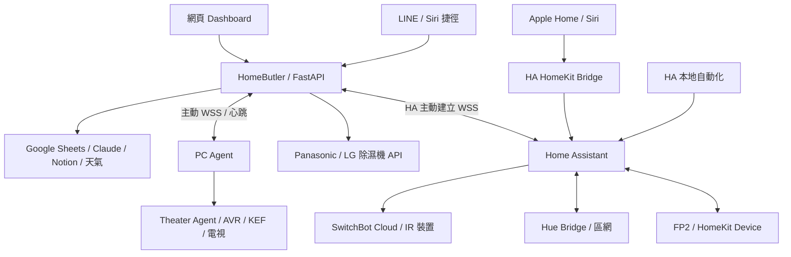

# HomeButler｜家庭 AI 管家

透過 LINE、Siri 捷徑與網頁 Dashboard 管理家電、家庭待辦、食品庫存和提醒。
HomeButler 負責家庭資料與 AI 理解；目前推薦搭配 Home Assistant（HA），
由 HA 管理設備整合、本地自動化及 Apple Home 配件。

這是持續開發的自架專案，各設備需自行設定帳號、配對與控制權限，並非安裝後就能操作所有品牌。
本專案由使用者規劃需求、透過 AI 協作開發。

**開始使用：** [選擇架構與版本](#選擇架構與版本) · [架構](#目前架構) · [建置](#開始建置) ·
[設定與 API](docs/backend-guide.md) · [Dashboard](https://github.com/CZLin-TW/Dashboard) · [驗證紀錄](docs/verification.md)

## 自動關機更新

v1.57.0 將時數設定留在 Sheet「自動關機小時數」欄位：0／空白停用，1–168 整數小時。
HB 觀察 HA 開機後產生一次性關機排程，Dashboard 在原「排程」區編輯或刪除；只影響本次，不改 Sheet 規則。
調溫不重置、刪除不補回；確認關機時清理這一輪尚未執行的關機排程，另建的未來排程保留。下次開機重新依 Sheet 產生。
[計時語意與限制](docs/ac-auto-off.md)。不建立 HA 自動化、不需更新 HA 整合。

## 手動排程更新

v1.55.0 恢復 Dashboard 的 HA 空調一次性手動排程：指定日期時間後，由 HB 經 HA 下達控制。
可新增、編輯與取消，支援開關、整數溫度、模式、風速；排程卡與表單同步統一視覺。
此版未恢復的自動關機已由 v1.57.0 接手，防黴與回饋仍停用；舊排程不會因更新而自動重新生效。
HB 每 60 秒檢查到期排程，須後端運行且 HA 連線；這不是 HA 自動化編輯器。無須更新 HA 整合。

## 照明光色更新

v1.54.0 Dashboard 加入白光色溫、可展開二維色盤（色相＋飽和度），保留亮度／特效／場景。
需更新 HA `home_butler` 至 **1.5.0** 才啟用新能力；HA 舊版與 legacy PC 仍保留原有控制。
混合燈具依能力套用，讀回實際色彩或混合狀態；未知結果不重送、調色不附帶開機。
[控制契約與安裝](homeassistant/sensors-and-hue.md#光色控制home_butler-150)
HA 區域統一、除濕機區域對應及 ToDo 通知效果編輯屬後續規劃；這版尚未遷移。

## 選擇架構與版本

**HA 是可選整合，不是目前 main 的強制依賴。** 新的家庭中樞架構以 HA 為主要設備入口，
程式仍保留未遷移設備的直接 API／PC Agent 路徑。

| 你的需求 | 選擇 | 注意事項 |
| --- | --- | --- |
| 新建系統，希望統一 HA／Apple Home／Dashboard | 目前 `main` ＋ HA | 依設備明確切換；不是自動發現後就全部交給 HA |
| 不裝 HA，但希望使用目前的程式 | 目前 `main`，不啟用 HA | 三組 HA 名稱清單留 `[]`、HA Hue 設 `false`；保留自己的直接 API／PC Agent 設定 |
| 要完整停留在加入 HA 之前的架構 | **v1.44.0 固定快照** | 後端與 Dashboard 成套取得；不包含後續 HA 功能與修正 |

**最後一組加入 HA 之前的版本是 v1.44.0：**

| 元件 | 固定 commit | 下載 |
| --- | --- | --- |
| HomeButler 後端（含 PC Agent／Homebridge 原始碼） | [5c0b681](https://github.com/CZLin-TW/home-butler/tree/5c0b681f149741236d16d100bf96b734d1b1f767) | [ZIP](https://github.com/CZLin-TW/home-butler/archive/5c0b681f149741236d16d100bf96b734d1b1f767.zip) |
| Dashboard | [2c31431](https://github.com/CZLin-TW/Dashboard/tree/2c31431d0588e4cfbe8323384234f64d092dfd9d) | [ZIP](https://github.com/CZLin-TW/Dashboard/archive/2c31431d0588e4cfbe8323384234f64d092dfd9d.zip) |

這是「HA 導入前的最後快照」，**不是「最後能在沒有 HA 時執行的版本」**。
目前沒有獨立舊版維護分支或 GitHub Release；顯示版本來自 Dashboard `package.json`，
固定程式請用 commit SHA，不能執行 `git checkout v1.44.0` 假設已有 tag。
GitHub 可以下載特定 commit，Git 也能切換至它；完整指令、回到 main、部署固定及自動更新注意事項，
見 [版本選擇與舊版下載](docs/version-selection.md)。

## 目前架構

圖中設備路徑表示已啟用 HA 的配置；不使用 HA 的設備仍可走 HB 直接 API，Hue 可走 PC Agent。
SwitchBot Cloud 本身仍經雲端，不能把整套架構稱為全本地。
HA／Hue／FP2 的本地互動不需經 Render；Hub 2 快速刷新提示目前仍走 SwitchBot Webhook → Render → HA。

| 元件 | 責任 |
| --- | --- |
| 本 repo：HomeButler | LINE／Siri 意圖、家庭權限、待辦庫存、Sheets、提醒、設備 API 及選定 HA 能力轉送 |
| [Dashboard](https://github.com/CZLin-TW/Dashboard) | UI、配對登入、Session、使用者身分驗證與後端 API 代理；不是直接持有家電金鑰的純靜態頁面 |
| [HA 自訂整合](homeassistant/README.md) | 主動連接 HB，同步選定觀測／狀態，執行有限的空調、IR 按鈕及 Hue 控制 |
| [PC Agent](agent/README.md) | PC 健康指標與劇院中繼；未啟用 HA Hue 時也可控制 Hue |
| [Theater Agent](https://github.com/CZLin-TW/theater-agent)（私人 repo、選配） | AVR／KEF／電視／Apple TV 的專用連動；不需要劇院功能就不需存取此 repo |
| Homebridge（舊路徑、選配） | 讓未遷移 HA 的 HB 空調進 Apple Home；新 HA 配置使用 HA HomeKit Bridge，無需同時安裝 |

每台設備的控制來源由設定決定；HA 失聯不會偷偷改走另一條 IR 或雲端路徑。
IR 的「最後指令」不等於設備真實狀態，API 成功也不代表硬體已確實動作。

## 功能與邊界

| 功能 | 目前提供 |
| --- | --- |
| 家庭待辦／週期待辦 | 成員及私人／公開事項、完成與封存、到期提醒；可選 Notion 同步 |
| 食品庫存 | 新增、查詢、修改、消耗與到期提醒 |
| 自然語言 | Claude 意圖解析與結構化輸出；LINE 多輪對話、Siri 單次完整指令及簡潔朗讀 |
| 空調 | HA 管理空調的電源、整數目標、模式與風速；Apple Home 可配外部室溫 sensor |
| IR 電扇 | 電源、自訂風速＋／－按鈕；不推測實際電源狀態或風量百分比 |
| 感測器 | 溫濕度／CO₂ 即時值與 24 小時歷史；Hub 2 光照等級、FP2 存在／lux 為即時觀測 |
| Hue | 區域開關、亮度、場景、支援的燈效與通知；HA Hue 啟用時待辦燈光提醒也經 HA |
| 除濕機 | Panasonic／LG 原 API 與 HB 濕度自動模式；依目前需求保留 HB 控制，不列 HA 遷移待辦 |
| PC／劇院 | PC 狀態與歷史、Agent 失聯告警；劇院專用連動仍由獨立 Agent 執行 |

**自動化在哪裡設定：** HA 管理空調的自動開關、冷卻等待、固定時間等規則在 HA 設定。
Dashboard 不會編輯 HA 自動化；新建的手動排程由 HB 經 HA 執行，舊防黴與回饋補償不對已遷移空調執行。
到期關機由 HB 觀察 HA 開機後、依 Sheet「自動關機小時數」產生一次性關機排程，在原排程區編輯或刪除；計時與排程列都在 HB，不建立 HA 自動化。
半度目標與回饋補償不在目前 HA 空調功能範圍，舊程式僅為未遷移設備保留。
HB 保留除濕機規則與待辦提醒。v1.53.0 起移除 HB 自動夜燈引擎與 Dashboard 入口，
舊 Sheet 規則保留但不執行；夜燈改在 HA 設定，同一目標避免重複規則。

**感測更新：** Hub 2 可使用 [光照整合](homeassistant/hub-light.md) 的 Push 提示＋原生 API 驗證讀取，
整合內備援預設 60 秒、可設 60～3600 秒。它與五分鐘歷史採樣分開，
不代表每分鐘一定有新量測；Hub 光照 1～20 級與 FP2 的 lux 是不同單位。

## 開始建置

1. **先選路徑。** 使用 HA 看下方步驟；不使用 HA 看 [設定方式與版本固定](docs/version-selection.md)。
2. **準備後端。** Python、LINE Messaging API、Google Sheets／Service Account、Claude API，
   依 [後端建置指南](docs/backend-guide.md#完整建置流程) 設定；其他品牌、Notion、天氣均依需求選配。
   安裝使用 `requirements.lock`，部署設定見 [render.yaml](render.yaml)。
3. **部署 Dashboard。** 依 [Dashboard README](https://github.com/CZLin-TW/Dashboard) 設定後端網址、
   伺服器端 API Key 與 Session Secret，再由 LINE 配對登入。只用 LINE 時可不部署 Dashboard。
4. **使用 HA 時，先確認原生裝置可用。** 在 HA 設定 FP2、SwitchBot Cloud、Hue；
   然後安裝本 repo 的 [Home Butler 整合](homeassistant/README.md)，由 HA 主動 WSS 連回後端。
5. **逐項啟用。** 依 [空調](homeassistant/README.md#空調遷移)、[室溫配對](homeassistant/room-temperature.md)、
   [IR 電扇](homeassistant/ir-buttons.md)、[感測器／Hue](homeassistant/sensors-and-hue.md) 文件設定兩端清單。
   先確認資料與控制，再將需要的配件經 HA HomeKit Bridge 加入 Apple Home。

HA 自訂整合以 HA OS／Core 2026.9.2 為目前測試基準；各整合有獨立版本，
不等於 Dashboard 顯示版本。安裝使用通過 CI 的完整 commit，保留安裝器備份。
一般本地自動化不需把 HA 直接暴露到網際網路；遠端手機存取另用自己的 VPN 等安排。

### 設定與金鑰

完整清單見 [環境變數](docs/backend-guide.md#render-環境變數)。HA 相關設定為：

| 變數 | 用途／預設 |
| --- | --- |
| `HOME_ASSISTANT_API_KEY` | HA 連接 HB 的獨立金鑰；未設定不開放 HA 連線 |
| `HOME_ASSISTANT_AC_NAMES` | 交由 HA 控制的空調名稱，JSON 陣列；預設 `[]` |
| `HOME_ASSISTANT_IR_NAMES` | 交由 HA 控制的 IR 電扇名稱；預設 `[]` |
| `HOME_ASSISTANT_SENSOR_NAMES` | 以 HA 為唯一即時來源的感測器名稱；預設 `[]` |
| `HOME_ASSISTANT_HUE_ENABLED` | `true` 使用 HA Hue；預設 `false` 使用原 PC Agent 通道 |

名稱需精確對應 Sheet／HA 配對，設定錯誤或 HA 失聯不會自動恢復直連。
使用 HA Hub Push 仍需後端保留 SwitchBot Webhook 註冊憑證；細節見 [光照文件](homeassistant/hub-light.md)。
金鑰只設於自己的受信任執行環境；owner、HA、Homebridge、家電語音各用獨立金鑰。

### Siri 與家人權限

Apple Home／Siri 可直接控制 HA 已匯出的配件；「管家」捷徑則把文字送到 HB，提供自然語言家庭功能。
完整 `/api/assistant` 使用 owner Key，傳入 User ID 只作身分，不是降低權限的機制。
長輩／小孩若只需家電，改用 `/api/assistant/devices` 與獨立 `DEVICE_VOICE_API_KEY`，
不提供待辦、庫存或私人對話操作。設定及收音問題見 [Siri 指南](docs/backend-guide.md#siri-語音控制ios-捷徑)
與 [家電專用捷徑](docs/backend-guide.md#device-only-voice)。

### 常駐、資料與費用

HB 目前使用 Google Sheets 保存家庭資料、規則與歷史，搭配程序內快取與工作排程。
後端需維持單一 process／worker；服務休眠會影響 HB 提醒與排程，健康監控不等於常駐保證。
HA 的本地規則與 Hub 備援計時可繼續運行，但 SwitchBot Cloud 與雲端 Push 仍有各自的網路依賴。
Claude API、LINE 推播、主機與其他服務依使用量及方案計費，不承諾所有配置皆免費。

## 開發、驗證與文件

僅查看介面可在 Dashboard 獨立 checkout 執行 `npm ci`、`npm run demo`；
它使用合成資料，不需要 LINE 配對或真實家電。[Demo 說明](https://github.com/CZLin-TW/Dashboard/blob/main/docs/demo-mode.md)

後端離線測試為 `python -m unittest discover -s tests -v`；HA framework 測試另在 Linux 執行，
方法見 [驗證文件](docs/verification.md)。不要用會呼叫真實家電的診斷腳本代替離線測試。

目前家庭配置已完成感測器與 Hue 路徑切換及 Dashboard 唯讀驗證；
各房間硬體、Hue 場景／效果等完整驗收仍以 [驗證紀錄](docs/verification.md) 為準，不能從 CI 或版本號推定。
Hub 2 物理按鈕的 Matter 自動化與本地相機分析尚未在本專案部署。

| 文件 | 內容 |
| --- | --- |
| [版本選擇](docs/version-selection.md) | 不用 HA 的選項、v1.44.0 成套下載、Git 與部署固定 |
| [後端設定與 API](docs/backend-guide.md) | Sheets 欄位、環境變數、REST API、Siri、待辦／庫存規則與選配驅動 |
| [系統導覽](docs/system-overview.md) | 多 repo 責任、資料路徑、版本與回復 |
| [家庭中樞架構](docs/local-hub-architecture.md)／[遷移盤點](docs/ha-migration-audit.md) | 現有 HA 分工、仍待處理的項目 |
| [HA 安裝](homeassistant/README.md) | 安裝整合、配對與逐台遷移 |
| [PC Agent](agent/README.md)／[舊 Homebridge](homebridge/README.md) | 各自獨立部署與更新 |
| [語音計時](docs/voice-timing.md)／[模型評估](evals/README.md) | 真實耗時與離線／模型測試的範圍 |
| [AGENTS.md](AGENTS.md) | 新開發者與 AI Session 的維護規則 |

文件與實作一起維護；純文件變更不調整系統顯示版本，也不代表設備或 HA 套件重新部署。
